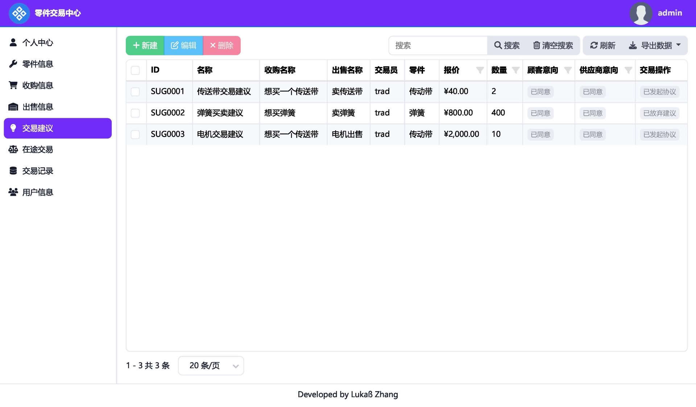
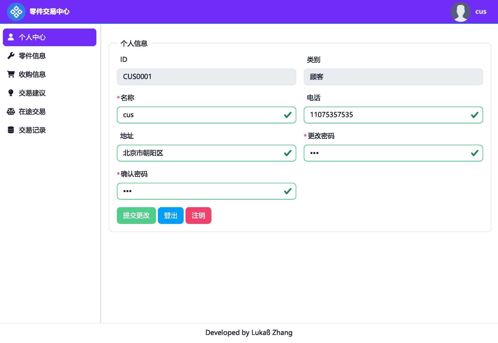
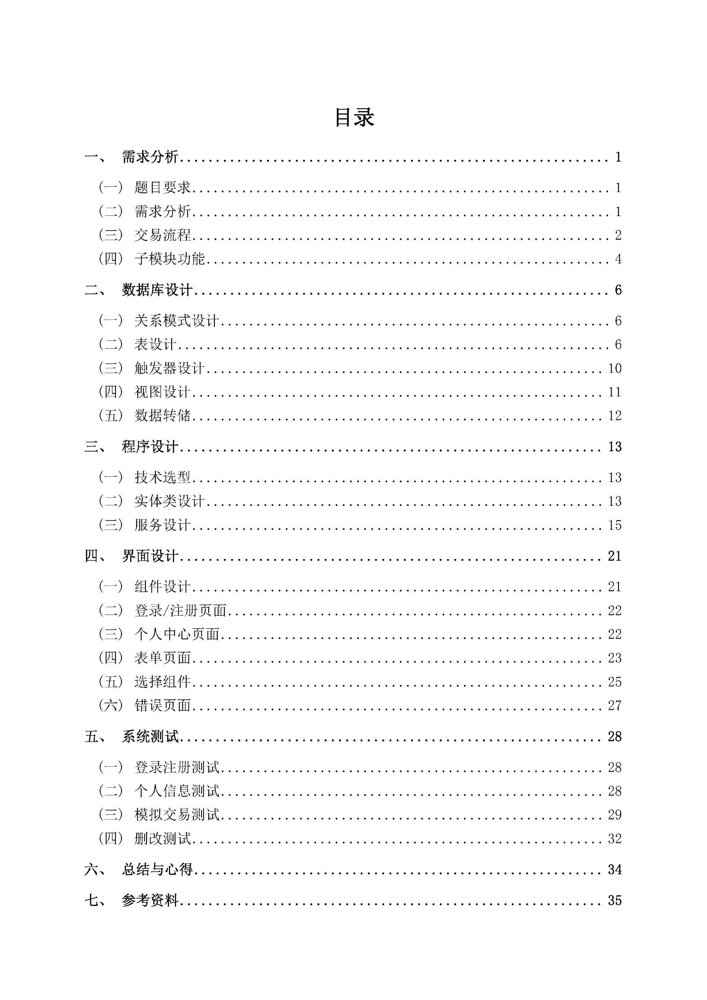

# ComponentTradeCenter

## 数据库原理课程设计：零件交易中心

 
 

### 项目概述

* **开发框架**：ASP\.NET Core Blazor
* **ORM框架**：Microsoft EntityFramework Core
* **DBMS**：MySQL 8.0.40
* **组件库**：BootstrapBlazor
* **开发环境**：Microsoft Visual Studio 2022

### 功能简介

1. 提供顾客、供应商、交易员和管理员的登录和注册；
2. 根据用户的类型对数据操作权限进行差异化管理；
3. 为交易员提供匹配的供需信息视图，便于其分析供需情况；
4. 实现提出交易建议、审批协议书等功能，提供合理安全的交易流程；
5. 数据库记录的删除操作使用更安全的软删除；
6. 定期生成转储文件，自动删除过时的转储文件。

### 效果展示

|||
|:-:|:-:|
|**主界面**|**个人中心**|
|**登录页面**|**课设报告**|

### 其他

本项目的[课程设计报告](docs/数据库课程设计报告.docx)位于`docs`目录中，内有详实的设计过程可供参考。如有疑问或发现Bug，请提交issues以供交流。

Copyright (c) 2024 Lukaß Zhang. Released under [MIT License](LICENSE).
